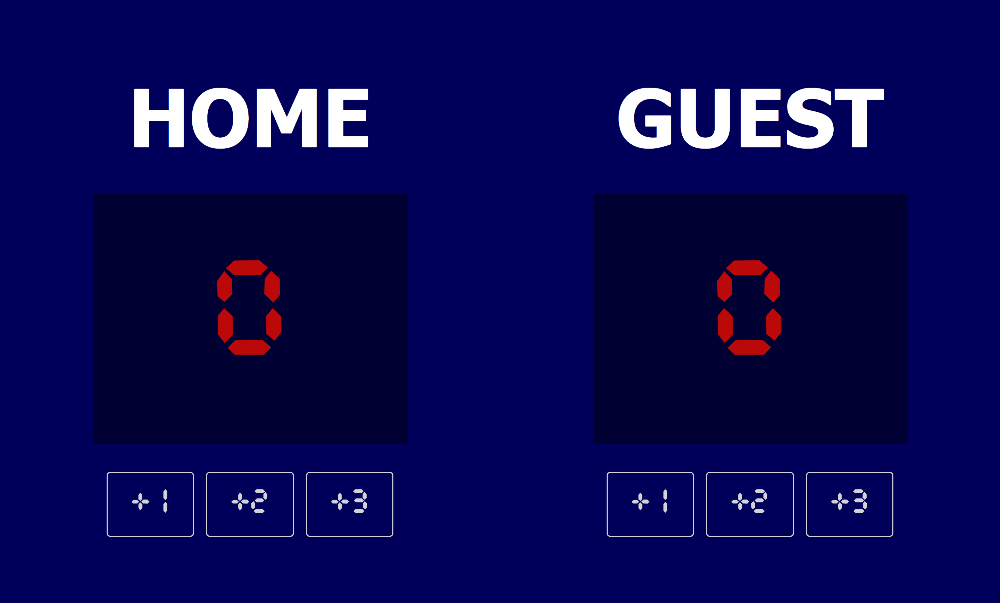

   
    
   
   

  

    
    
    
  

  <h3 align="center">Basketball Scoreboard</h3>

## 📋 <a name="table">Table of Contents</a>

1. 🤖 [Introduction](#introduction)
2. ⚙️ [Tech Stack](#tech-stack)
3. 🔋 [Features](#features)
4. ⭐ [Let's Connect](#follow-me)

## <a name="introduction">🤖 Introduction</a>

A clean, responsive basketball scoreboard app built with vanilla web technologies. Track points for both Home and Guest teams in real time — without any frameworks! Built as a solo project to sharpen DOM manipulation skills.

## <a name="tech-stack">⚙️ Tech Stack</a>

- HTML5
- CSS3
- Vanilla JS

## <a name="features">🔋 Features</a>

👉 **Live Score Tracking**: Instantly update the scoreboard for both Home and Guest teams with a single button click.

👉 **Multi-Point Buttons**: Award +1, +2, or +3 points per play — just like a real basketball game.

👉 **Retro LED Display**: Scores render in a custom Cursed Timer font against a dark display panel for that authentic scoreboard feel.

👉 **Fluid Typography**: Font sizes scale smoothly across all viewport widths using CSS `clamp()` — from phones to ultrawide monitors.

👉 **Responsive Layout**: Stacks vertically on small screens and spreads side-by-side on larger ones, always looking sharp.

👉 **CSS Design Tokens**: Colors, fonts, and font sizes all live in `:root` variables for easy theming and maintenance.

## <a name="follow-me">🤝🏾 Let's Connect</a>
**Hey there! Interested in working with me?**
Connect with me on [LinkedIn](https://www.linkedin.com/in/themelodyemmanuel) or shoot me an [email](mailto:melodyemmanuel152@gmail.com). Tech and career opportunities only, please 👀

Don't forget to (kindly) leave a star ⭐

Looking forward to geeking out together!

 

<i>courtesy of [Scrimba](https://www.scrimba.com) | [Per Harald Borgen](https://github.com/perborgen)</i>

 
 
 